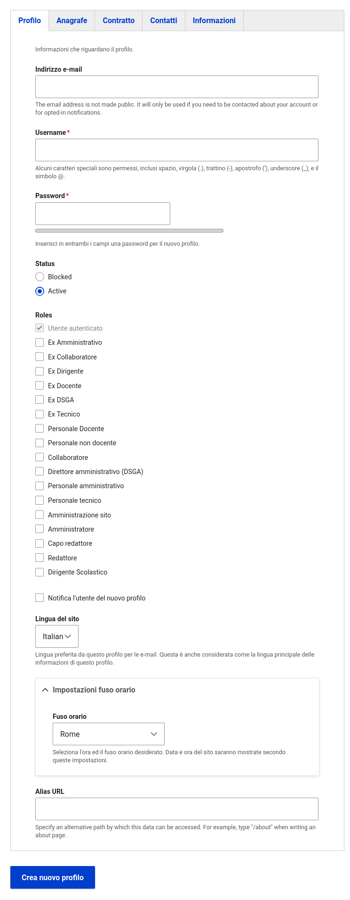

# Pròsopon


[Pròsopon](https://www.grecoantico.com/dizionario-greco-antico.php?parola=proswpon) è un modulo Drupal che gestisce l'entità Persona.
L'architettura dei campi è basata sulla [v1.0](https://docs.google.com/spreadsheets/d/1MoayTY05SE4ixtgBsfsdngdrFJf_Z2KNvDkMF3tKfc8/edit#gid=782511705)
dell'architettura dell'informazione dei siti web delle scuole,
il content type che importa questo modulo è il [CT persona](https://docs.google.com/spreadsheets/d/1MoayTY05SE4ixtgBsfsdngdrFJf_Z2KNvDkMF3tKfc8/edit#gid=1547596296)

## Requisiti
- Drupal: >= 10
- Profilo Drupal: `minimal`
- Moduli contrib: `field_group`
- Moduli Ouitoulìa: `lexika`

## Installazione
Per aggiungere il modulo alla tua installazione esegui:
```bash
$ composer require ouitoulia/prosopon
$ drush -y pm:install prosopon
```
Le dipendenze verranno installate automaticamente e questo è il risultato:




## Implementazione tipo Persona
| Architettura                               | Implementazione                                              | Note                                                               |
|--------------------------------------------|--------------------------------------------------------------|--------------------------------------------------------------------|
| Nome e cognome                             | field_nome, <br/>field_cognome                               | L'informazione è stata divisa in due campi                         |
| Foto della persona                         | field_picture                                                |                                                                    |
| Ruolo nell'organizzazione                  | entity:user, bundle:user_role                                | I ruoli vengono sincronizzati con `ouitoulia/sunchronizo_prosopon` |
| Ruolo (secondo livello)                    | entity:user, bundle:user_role                                |                                                                    |
| Biografia                                  | field_biografia                                              |                                                                    |
| Dove lavora                                | **View relazione con CT `luogo`**                            |                                                                    |
| Strutture di cui la persona è responsabile | **View relazione altri CT con `field_persona_responsabile`** |                                                                    |
| Materie                                    | field_materie                                                | Vocabolario `materie`                                              |
| Schede didattiche                          | **View relazione CT `scheda_didattica`**                     |                                                                    |
| Progetti                                   | **View relazione CT `progetto`**                             |                                                                    |
| Documenti                                  | **View relazione CT `documento`**                            |                                                                    |
| Ulteriori informazioni                     | field_extra_info                                             |                                                                    |
| Numero telefono pubblico                   | field_telefono                                               |                                                                    |
| Indirizzo email pubblico                   | field_email                                                  |                                                                    |
| Metadati                                   | **display**                                                  |                                                                    |
| Correlati                                  | **View relazione altri CT con `field_persone`, `author`**    |                                                                    |
| Tipologia incarico                         | field_tipologia_incarico                                     | Vocabolario `tipologia_incarichi`                                  |
| Durata incarico                            | field_data_fine_incarico                                     |                                                                    |
| Tipo posto                                 | field_tipologia_posto                                        | Vocabolario `tipologia_posti`                                      |
| Tipo supplenza                             | field_tipologia_supplenza                                    | Vocabolario `tipologia_supplenze`                                  |
| Genere                                     | field_genere                                                 |                                                                    |
| Data di nascita                            | field_data_di_nascita                                        |                                                                    |
| Codice fiscale                             | field_codice_fiscale                                         | **Campo aggiunto rispetto all'architettura**                       |


## License

Copyright (C) 2023 https://github.com/ouitoulia

This program is free software: you can redistribute it and/or modify it under the terms of the GNU General Public License version 3 as published by the Free Software Foundation.

This program is distributed in the hope that it will be useful, but WITHOUT ANY WARRANTY; without even the implied warranty of MERCHANTABILITY or FITNESS FOR A PARTICULAR PURPOSE. See the GNU General Public License for more details.

Questo è un software libero: puoi ridistribuirlo e/o modificarlo secondo i termini della GNU General Public License versione 3 pubblicata dalla Free Software Foundation.

Questo programma è distribuito nella speranza che possa essere utile, ma SENZA ALCUNA GARANZIA; senza nemmeno la garanzia implicita di COMMERCIABILITÀ o IDONEITÀ PER UNO SCOPO PARTICOLARE. Vedere la GNU General Public License per maggiori dettagli.