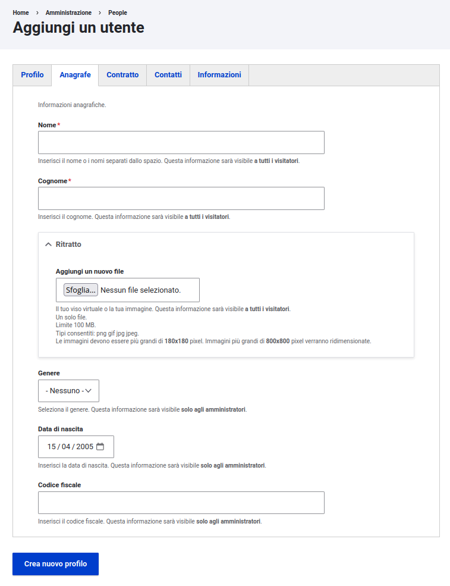
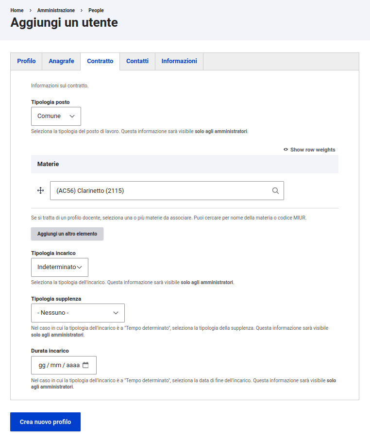
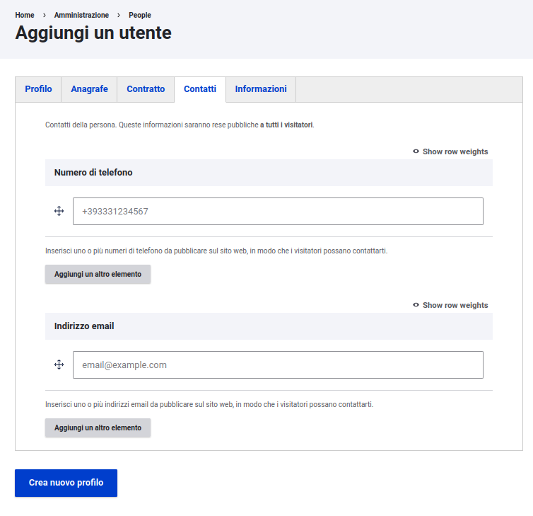
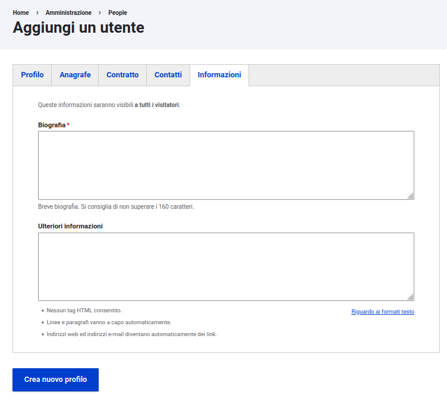

# Pròsopon
Pròsopon è un modulo Drupal che gestisce l'entità Persona.
L'architettura dei campi è basata sulla [v1.0](https://docs.google.com/spreadsheets/d/1MoayTY05SE4ixtgBsfsdngdrFJf_Z2KNvDkMF3tKfc8/edit#gid=782511705)
dell'architettura dell'informazione dei siti web delle scuole,
il content type che importa questo modulo è il [CT persona](https://docs.google.com/spreadsheets/d/1MoayTY05SE4ixtgBsfsdngdrFJf_Z2KNvDkMF3tKfc8/edit#gid=1547596296)

## Requisiti
- Drupal: >= 10
- Profilo Drupal: `minimal`

## Installazione
Per aggiungere il modulo alla tua installazione esegui:
```
$ composer require ouitoulia/prosopon
$ drush -y pm:install prosopon
```
Le dipendenze verranno installate automaticamente e questo è il risultato:







